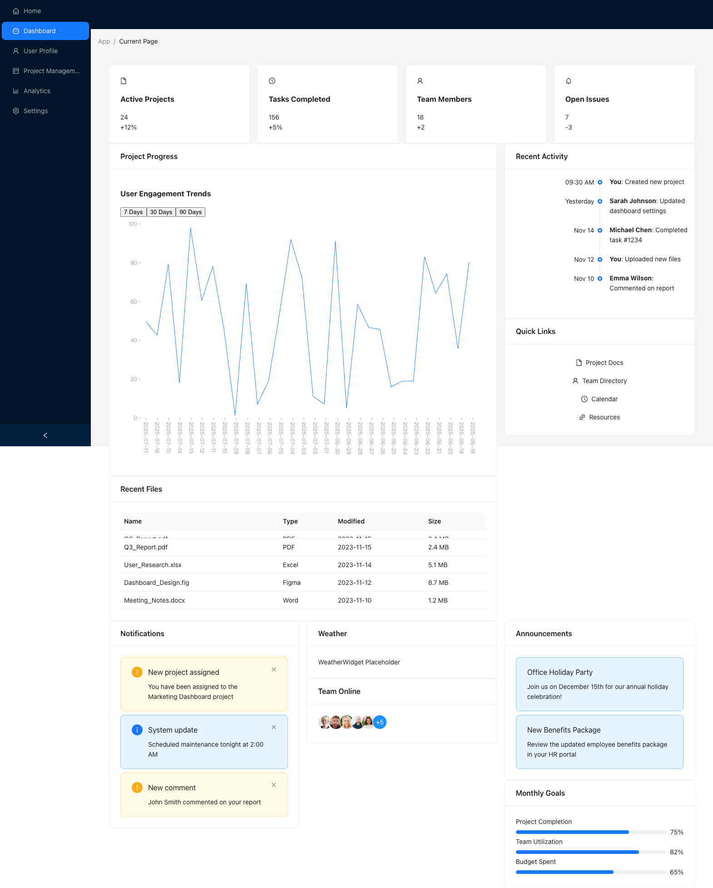
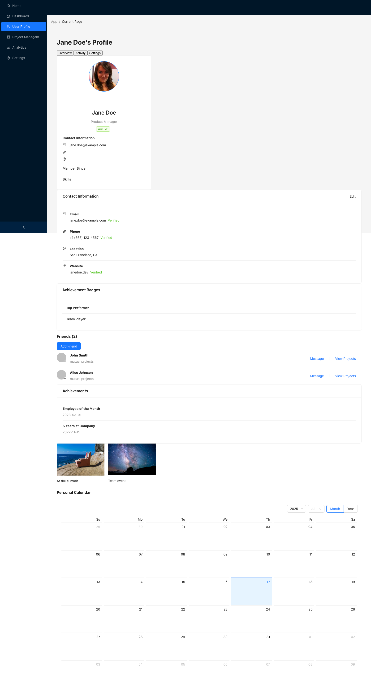
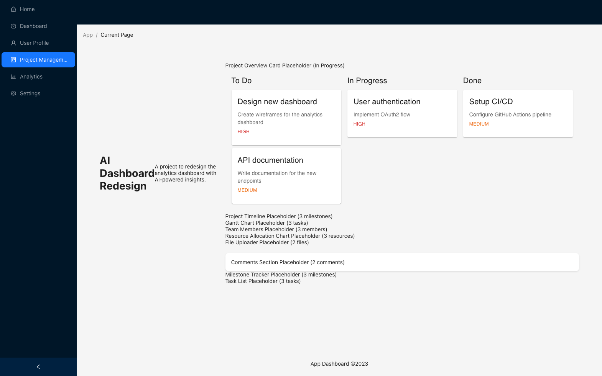
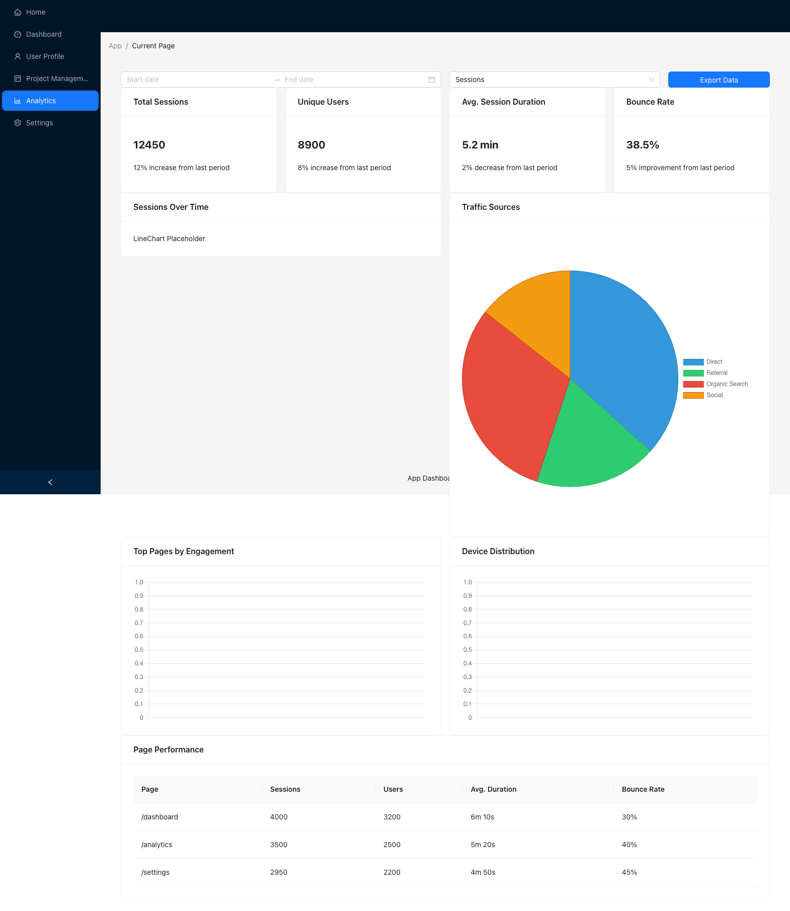
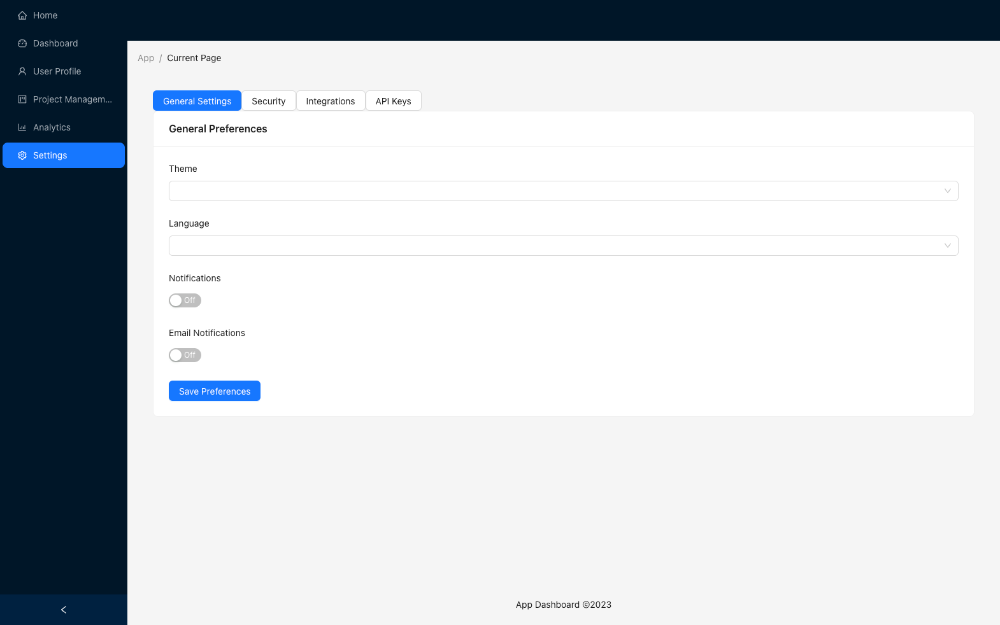
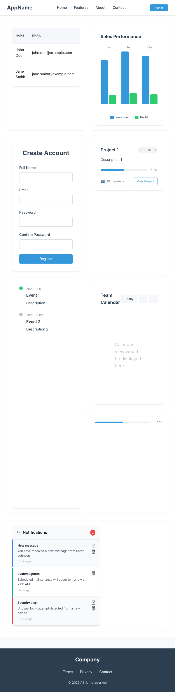

这里是挑选出Multi-Agent生成的比较好的项目：

## 5 Pages

> 类型：多页面应用

### 输入Prompt

[Prompt 源文件](../multi-agent-react-gen/gen-prompt-template/5-pages-detailed-app.txt)

```plaintext
You are to design a comprehensive 5-page web application. Follow these detailed instructions to ensure each page is unique, realistic, and fully specified:

General Requirements:
- The application must have 5 distinct pages, each with a unique theme and purpose. Example themes: Dashboard, User Profile, Analytics, Project Management, Settings, etc.
- Each page must contain at least 10 different UI components. No component type (e.g., Table, Chart, Form, Card, Timeline, Calendar, Map, etc.) may be used on more than one page.
- For each component, provide detailed, realistic, and context-appropriate content. Do not use generic placeholders like "Lorem ipsum" or "Sample Data"—instead, invent plausible data relevant to the page's theme.
- For each page, specify the layout (e.g., grid, sidebar, header/footer, etc.) and how components are arranged.
- The output should be structured in Markdown, with clear sections for each page and each component.
- For each component, include:
  - Component type (e.g., Table, Chart, Form, etc.)
  - Purpose on this page
  - Detailed content (e.g., for a table: column names and 3+ rows of realistic data; for a chart: what is being visualized and example values; for a form: all fields and example default values, etc.)
  - Any relevant interactions (e.g., buttons, filters, tabs, etc.)

Example Page Themes and Component Suggestions (you may invent your own, but do not repeat component types):
- Dashboard: KPI Cards, Line Chart, Notifications List, Activity Timeline, Progress Bar, Quick Links, Weather Widget, Recent Files Table, Announcements Banner, User Avatar Group
- User Profile: Profile Card, Editable Form, Achievements List, Friends List, Recent Activity Feed, Photo Gallery, Settings Accordion, Badges, Contact Info, Calendar
- Analytics: Bar Chart, Pie Chart, Data Table, Date Range Picker, Filters, Export Button, Heatmap, Trend Indicator, Map, Data Summary Cards
- Project Management: Kanban Board, Task List, Gantt Chart, Team Members, Project Timeline, File Uploader, Comments Section, Milestone Tracker, Resource Allocation Chart, Project Overview Card
- Settings: Preferences Form, Theme Switcher, Notification Toggles, Security Settings, API Keys Table, Connected Apps List, Language Selector, Password Change Form, Access Logs, Support Contact Card

**Do not use any component type more than once in the entire 5-page app.**
**Do not use generic or placeholder data.**

The goal is to create a rich, varied, and realistic multi-page application that demonstrates a wide range of UI patterns and data types, with no overlap in component usage between pages, and with all content fully and plausibly specified. 
```

### 项目地址

[complex-sys-upd 文件夹](./complex-sys-upd)

### 截图







## Dashboard

> 类型：单页面应用

### 输入Prompt

[Prompt 源文件](../multi-agent-react-gen/gen-prompt-template/single-page-10-components.txt)

```plaintext
You are to design a comprehensive single-page web application. Follow these detailed instructions to ensure the page is rich, realistic, and fully specified:

General Requirements:
- The application must consist of a single page containing **10 different UI components**. Each component type (e.g., Table, Chart, Form, Card, Timeline, Calendar, Map, etc.) must be unique on the page.
- For **each component**, you must provide **3 distinct variants**. Variants should differ in content, style, or configuration, demonstrating the flexibility and adaptability of the component type.
- All content must use **realistic, context-appropriate mocked data**. Do **not** use generic placeholders like "Lorem ipsum" or "Sample Data"—instead, invent plausible data relevant to the component's purpose (e.g., for a user table, use realistic user names, emails, and roles; for a chart, use plausible metrics and values, etc.).
- Specify the overall layout of the page (e.g., grid, sidebar, header/footer, etc.) and how the components and their variants are arranged.
- The output should be structured in Markdown, with clear sections for each component and its variants.
- For each component and each variant, include:
  - Component type (e.g., Table, Chart, Form, etc.)
  - Purpose on this page
  - Detailed, realistic content (e.g., for a table: column names and 3+ rows of plausible data; for a chart: what is being visualized and example values; for a form: all fields and example default values, etc.)
  - Any relevant interactions (e.g., buttons, filters, tabs, etc.)
  - **If the component involves interactivity or state, provide a real React function or code snippet that demonstrates how the state or logic would be implemented using React features such as useState, useEffect, or custom hooks.** For example, show how a toggle, form input, or data fetch would be handled in React.
  - **Where appropriate, include custom hooks or utility functions that encapsulate reusable logic for the component or its variants.**

Component Suggestions (you may invent your own, but do not repeat component types):
- Table, Chart, Form, Card, Timeline, Calendar, Map, Progress Bar, Notification List, Avatar Group, Accordion, File Uploader, Gallery, KPI Card, etc.

**Do not use any component type more than once on the page.**
**Do not use generic or placeholder data.**

The goal is to create a rich, varied, and realistic single-page application that demonstrates a wide range of UI patterns and data types, with all content fully and plausibly specified, and with each component shown in three distinct variants.  
**Additionally, ensure that interactive components are accompanied by real React code snippets (using hooks and state) to demonstrate their logic and interactivity.** 
```

### 项目地址

[complex-spa-upd 文件夹](./complex-spa-upd)

### 截图




## 老pipeline生成的项目

[README.old.md](./README.old.md)