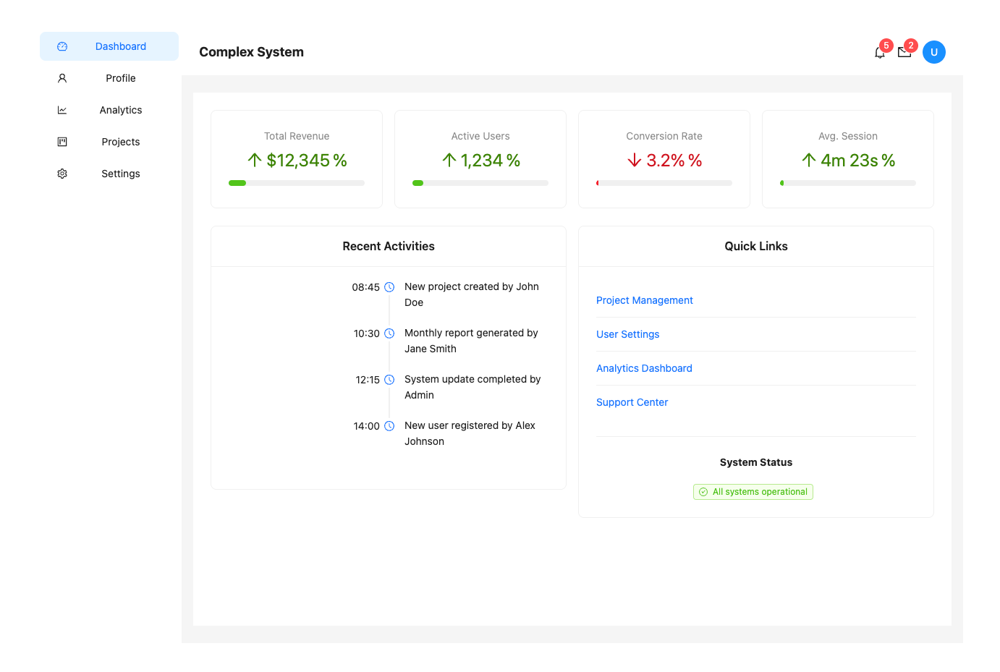
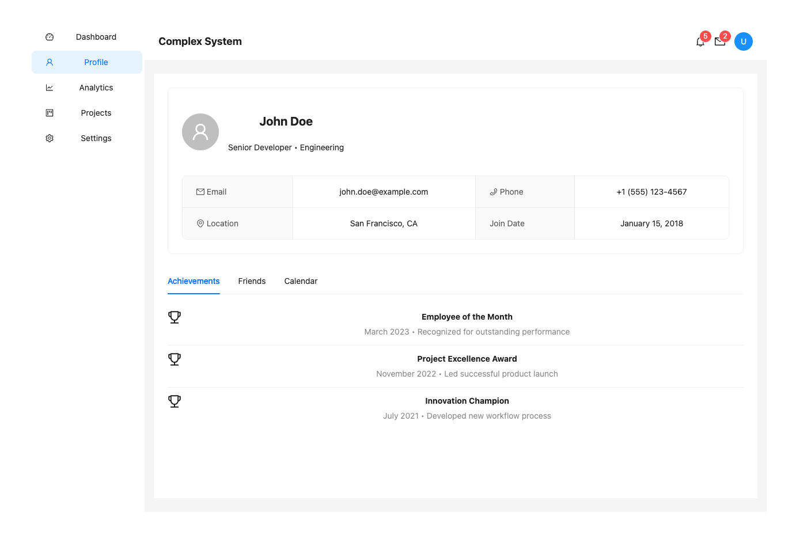
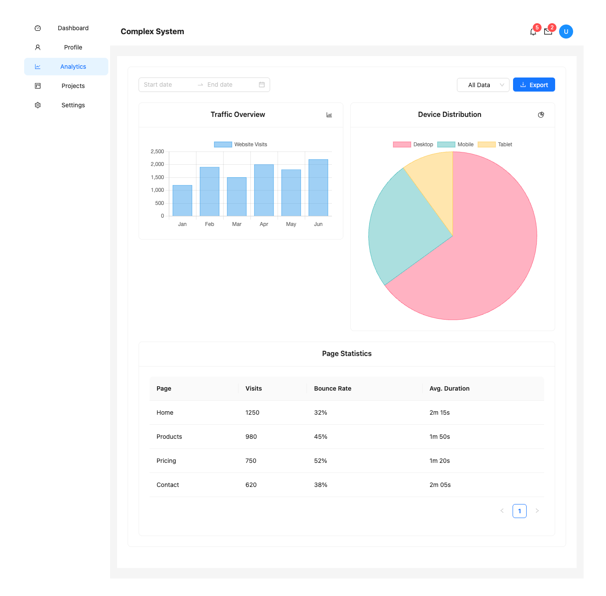
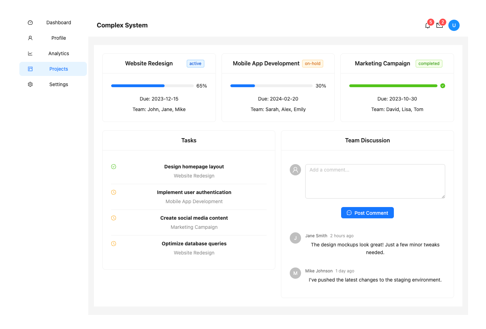
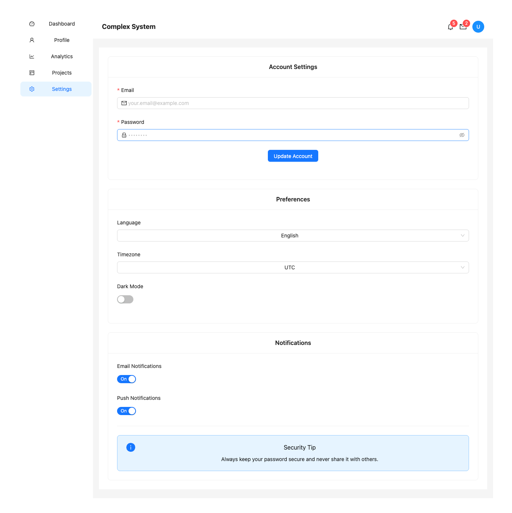
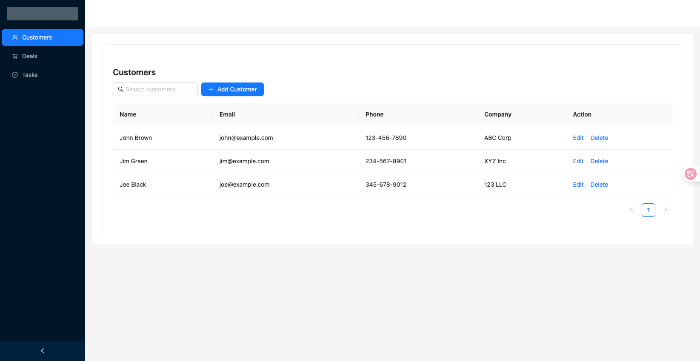
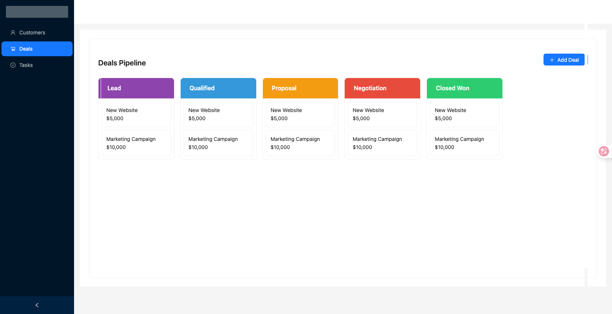
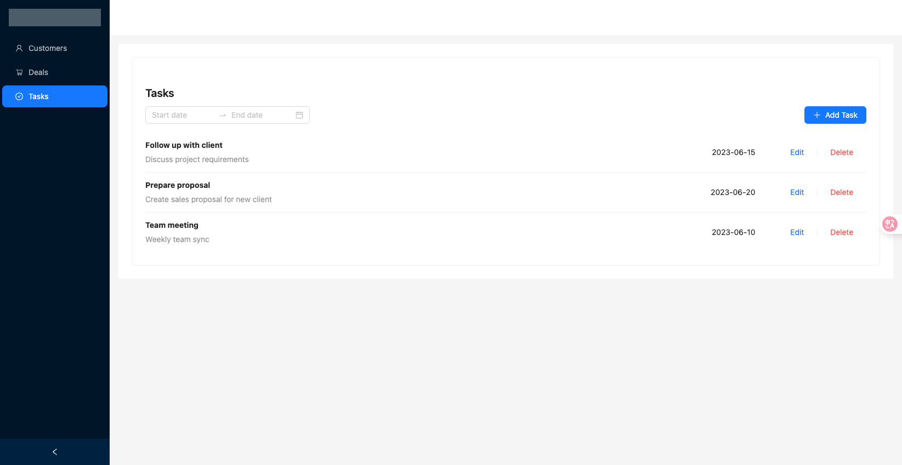
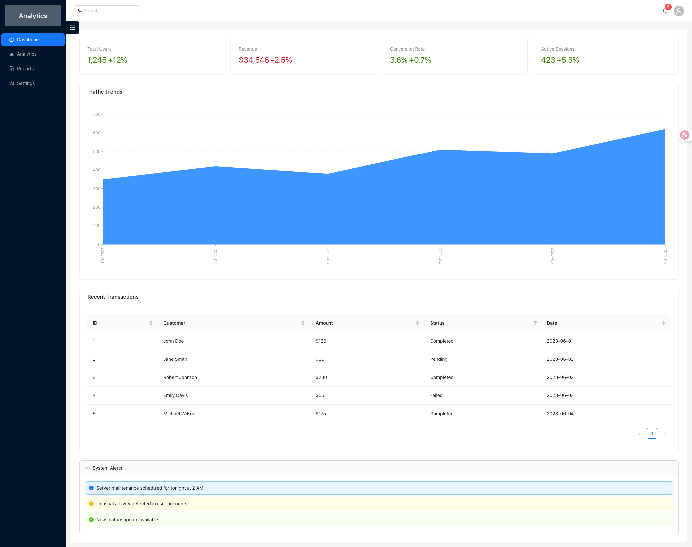

这里是挑选出Multi-Agent生成的比较好的项目：

## 5 Pages

> 类型：多页面应用

### 输入Prompt

[Prompt 源文件](../multi-agent-react-gen/gen-prompt-template/5-pages-detailed-app.txt)

```plaintext
You are to design a comprehensive 5-page web application. Follow these detailed instructions to ensure each page is unique, realistic, and fully specified:

General Requirements:
- The application must have 5 distinct pages, each with a unique theme and purpose. Example themes: Dashboard, User Profile, Analytics, Project Management, Settings, etc.
- Each page must contain at least 10 different UI components. No component type (e.g., Table, Chart, Form, Card, Timeline, Calendar, Map, etc.) may be used on more than one page.
- For each component, provide detailed, realistic, and context-appropriate content. Do not use generic placeholders like "Lorem ipsum" or "Sample Data"—instead, invent plausible data relevant to the page's theme.
- For each page, specify the layout (e.g., grid, sidebar, header/footer, etc.) and how components are arranged.
- The output should be structured in Markdown, with clear sections for each page and each component.
- For each component, include:
  - Component type (e.g., Table, Chart, Form, etc.)
  - Purpose on this page
  - Detailed content (e.g., for a table: column names and 3+ rows of realistic data; for a chart: what is being visualized and example values; for a form: all fields and example default values, etc.)
  - Any relevant interactions (e.g., buttons, filters, tabs, etc.)

Example Page Themes and Component Suggestions (you may invent your own, but do not repeat component types):
- Dashboard: KPI Cards, Line Chart, Notifications List, Activity Timeline, Progress Bar, Quick Links, Weather Widget, Recent Files Table, Announcements Banner, User Avatar Group
- User Profile: Profile Card, Editable Form, Achievements List, Friends List, Recent Activity Feed, Photo Gallery, Settings Accordion, Badges, Contact Info, Calendar
- Analytics: Bar Chart, Pie Chart, Data Table, Date Range Picker, Filters, Export Button, Heatmap, Trend Indicator, Map, Data Summary Cards
- Project Management: Kanban Board, Task List, Gantt Chart, Team Members, Project Timeline, File Uploader, Comments Section, Milestone Tracker, Resource Allocation Chart, Project Overview Card
- Settings: Preferences Form, Theme Switcher, Notification Toggles, Security Settings, API Keys Table, Connected Apps List, Language Selector, Password Change Form, Access Logs, Support Contact Card

**Do not use any component type more than once in the entire 5-page app.**
**Do not use generic or placeholder data.**

The goal is to create a rich, varied, and realistic multi-page application that demonstrates a wide range of UI patterns and data types, with no overlap in component usage between pages, and with all content fully and plausibly specified. 
```

### 项目地址

[complex-sys 文件夹](./complex-sys)

### 截图







## CRM

> 类型：多页面应用

### 输入Prompt

[Prompt 源文件](../multi-agent-react-gen/gen-prompt-template/crm-antd.txt)

```plaintext
Build a simple CRM (Customer Relationship Management) web app using Ant Design (AntD). The app should include:
- A login page with email/password authentication
- A main layout with a sidebar for navigation (Customers, Deals, Tasks)
- A Customers page with a searchable, filterable table of customers (use AntD Table)
- A Deals page showing a Kanban board for sales stages (use AntD Card and Drag & Drop)
- A Tasks page with a list of tasks and due dates (use AntD List and DatePicker)
- Forms for adding/editing customers and deals (use AntD Form)
- Responsive design and TypeScript
```

### 项目地址

[crm 文件夹](./crm)

### 截图





## Dashboard

> 类型：单页面应用

### 输入Prompt

[Prompt 源文件](../multi-agent-react-gen/gen-prompt-template/complex-dashboard.txt)

```plaintext
Build a single-page analytics dashboard app using Ant Design (AntD) and TypeScript. The dashboard should include:
- A fixed sidebar with navigation icons for Dashboard, Analytics, Reports, and Settings
- A top bar with the app logo, search bar, notifications bell, and user avatar dropdown
- A main content area with:
  - A grid of four summary cards (Total Users, Revenue, Conversion Rate, Active Sessions) using AntD Card and Statistic
  - A large area chart for traffic trends (use AntD Chart or a compatible library)
  - A table of recent transactions with sorting and filtering (use AntD Table)
  - A collapsible panel for system alerts (use AntD Collapse and Alert)
- Responsive design for desktop and mobile
- All layout and components should be in a single page (no routing)
- Use best practices for file structure and code organization 
```

### 项目地址

[dashboard 文件夹](./dashboard)

### 截图

